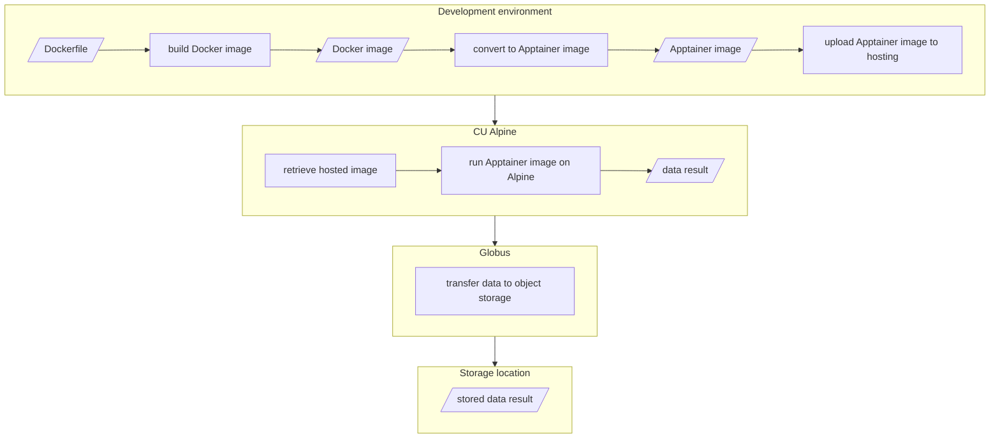

# RTX-KG2 Build and Run Notes for CU Alpine

This readme describes how to build RTX-KG2 dataset generation image(s) and how to obtain the data for use on other systems.
Content here references and modifies steps from [`README.md`](README.md).

## Proposed Goal



## Image build

This section describes how to build the image which will be used to create the dataset.

### Requirements

The following resources are suggested for building the image (and not creating the dataset).

- __Resources__:
  - 32 GB of system memory
  - 1 GB of disk space

### Steps

1. Install Docker Desktop.

#### Image build and upload

1. Build images by running `sh ./cudbmi-set/build.images.sh`

   1. Build an Docker image `kg2:latest`: `docker image build -t kg2 ./Dockerfile`
   1. Build an extended Docker image which references the original kg2 image build (for decoupled additions from the upstream): `docker image build -t kg2-cudbmi-set ./cudbmi-set/Dockerfile.build-extended`
   1. Convert the related materials into Apptainer/Singularity images.

#### Testing within the container

1. Run and enter the container shell `singularity exec --writable-tmpfs -e --userns --cleanenv images/kg2-cudbmi-set.sif /bin/bash`

1. Run the script `bash -x RTX-KG2/cudbmi-set/run.kg2-scripts.sh`

   1. Become user `ubuntu`: `su - ubuntu`
   1. Setup the KG2 build system: `bash -x RTX-KG2/setup-kg2-build.sh`

1. At some point, the script will print `fatal error: Unable to locate credentials`

1. The script will then prompt you to enter:

   - your AWS Access Key ID
   - your AWS Secret Access Key
     - (both for an AWS account with access to the private S3 bucket that is configured in `master-config.shinc`)
   - your default AWS region, which in our case is normally `us-west-2`
     - (you should enter the AWS region that hosts the private S3 bucket that you intend to use with the KG2 build system)
   - When prompted `Default output format [None]`, just hit enter/return.

1. If all goes well, the setup script should end with the message: `upload: ../setup-kg2-build.log to s3://rtx-kg2-versioned/setup-kg2-build.log`

1. Look in the log file `~/kg2-build/setup-kg2-build.log` to see if the script
   completed successfully; it should end with `======= script finished ======`.
   In that case it is safe to proceed.

1. Run a "dry-run" build: `bash -x ~/kg2-code/build-kg2-snakemake.sh all -F -n`

1. inspect the file `~/kg2-build/build-kg2-snakemake-n.log` that will be created, to make sure that all of the KG2 build tasks are included. Currently, the file should end with the following count of tasks:

   ```
   Job counts:
           count   jobs
           1       ChEMBL
           1       ChEMBL_Conversion
           1       DGIdb
           1       DGIdb_Conversion
           1       DisGeNET
           1       DisGeNET_Conversion
           1       DrugBank
           1       DrugBank_Conversion
           1       DrugCentral
           1       DrugCentral_Conversion
           1       Ensembl
           1       Ensembl_Conversion
           1       Finish
           1       GO_Annotations
           1       GO_Annotations_Conversion
           1       HMDB
           1       HMDB_Conversion
           1       IntAct
           1       IntAct_Conversion
           1       JensenLab
           1       Jensenlab_Conversion
           1       KEGG
           1       KEGG_Conversion
           1       Merge
           1       NCBIGene
           1       NCBIGene_Conversion
           1       Ontologies_and_TTL
           1       Reactome
           1       Reactome_Conversion
           1       RepoDB
           1       RepoDB_Conversion
           1       SMPDB
           1       SMPDB_Conversion
           1       SemMedDB
           1       SemMedDB_Conversion
           1       Simplify
           1       Simplify_Stats
           1       Slim
           1       Stats
           1       TSV
           1       UMLS
           1       UniChem
           1       UniChem_Conversion
           1       UniProtKB
           1       UniProtKB_Conversion
           1       ValidationTests
           1       miRBase
           1       miRBase_Conversion
           48
   This was a dry-run (flag -n). The order of jobs does not reflect the order of execution.
   + date
   Thu Aug  5 00:00:40 UTC 2021
   + echo '================ script finished ============================'
   ================ script finished ============================
   ```

1. Upload Singularity image to Github repo

## Dataset creation

This section describes how to create the dataset by running a container based on the image built above.

- __Resources__:
  - 256 GiB of system memory
  - 1,023 GiB of disk space in the root file system
- __Data__:
  - pre-placed in related S3 buckets (referenced by `master-config.shinc` `s3_bucket`, `s3_bucket_public`, and
    `s3_bucket_versioned`):
    - full
      Unified Medical Language System (UMLS) distribution: `umls-2022AA-metathesaurus.zip` ([UMLS website](https://www.nlm.nih.gov/research/umls/))
    - DrugBank distribution (`drugbank.xml.gz`)
- __Time duration__:
  - estimated to take 54-67 hours with Snakemake running on the built image
- __Data result__:
  - `kg2-simplified.json.gz`
  - Each build of KG2 is labeled with a unique build date/timestamp. The build timestamp can be found in the `build` slot of the `kg2-simplified.json` file and it can be found in the node with ID `RTX:KG2` in the Neo4j KG2 database.
  - Viewing progress: `tail -f ~/kg2-build/build-kg2-snakemake.log`
  - At the end of the build process, you should inspect the logfile `~/kg2-build/filter_kg_and_remap_predicates.log`

### Steps

Note: this assumes the section above, resulting in a Github Singularity image release is available.

#### Run container

1. Retrieve Apptainer/Singularity image from GitHub: `curl -LJO https://github.com/d33bs/RTX-KG2/releases/download/cudbmi-set-singularity-image/kg2-cudbmi-set.sif`

1. `singularity exec --writable-tmpfs -e --userns --cleanenv images/kg2-cudbmi-set.sif /bin/bash`

#### Prepare and validate container configuration

These steps are repeated from above as they only exist in the container and must be reproduced in each container runtime.

1. Run the script `bash -x RTX-KG2/cudbmi-set/run.kg2-scripts.sh`

   1. Become user `ubuntu`: `su - ubuntu`
   1. Setup the KG2 build system: `bash -x RTX-KG2/setup-kg2-build.sh`

1. At some point, the script will print `fatal error: Unable to locate credentials`

1. The script will then prompt you to enter:

   - your AWS Access Key ID
   - your AWS Secret Access Key
     - (both for an AWS account with access to the private S3 bucket that is configured in `master-config.shinc`)
   - your default AWS region, which in our case is normally `us-west-2`
     - (you should enter the AWS region that hosts the private S3 bucket that you intend to use with the KG2 build system)
   - When prompted `Default output format [None]`, just hit enter/return.

1. If all goes well, the setup script should end with the message: `upload: ../setup-kg2-build.log to s3://rtx-kg2-versioned/setup-kg2-build.log`

1. Look in the log file `~/kg2-build/setup-kg2-build.log` to see if the script
   completed successfully; it should end with `======= script finished ======`.
   In that case it is safe to proceed.

#### Data builds

- THIS STEP COMMENCES THE BUILD. Within the screen session, run: `bash -x ~/kg2-code/build-kg2-snakemake.sh all -F`
- Test build: `bash -x ~/kg2-code/build-kg2-snakemake.sh alltest`
  - In the case of a test build, the a couple log file names are changed:
    - `~/kg2-build/build-kg2-snakemake-test.log`
    - `~/kg2-build/build-kg2-ont-test-stderr.log`
    - and all of the intermediate JSON and TSV files that the build system creates will have `-test` appended to the filename before the usual filename suffix (`.json`).
- Partial Test Build: `bash -x ~/kg2-code/build-kg2-snakemake.sh test`
  - This option is frequently used in testing/development. Note, you have to have previously run an `alltest` build, or else a `test` build will not work.
- Viewing progress: `tail -f ~/kg2-build/build-kg2-snakemake.log`

1. Data log validation:

   - At the end of the build process, you should inspect the logfile `~/kg2-build/filter_kg_and_remap_predicates.log`

## Dataset transfer

This section describes how to transfer the data created by from the dataset creation steps above.

## Transcribed original directions

Original mostly unmodified directions as step-by-step for reference with usecases and troubleshooting on the above.

1. Install Docker Desktop.

1. Build a Docker image `kg2:latest`: `sudo docker image build -t kg2 ./Dockerfile`

1. Create a container called `kg2` from the `kg2:latest` image: `sudo docker create --name kg2 kg2:latest`

1. Start the `kg2` container: `sudo docker start kg2`

1. Open a bash shell as user `root` inside the container: `sudo docker exec -it kg2 /bin/bash`

1. Become user `ubuntu`: `su - ubuntu`

1. Install the `git` and `screen` packages if they are not already installed (though
   in an Ubuntu 18.04 instance created using the standard AWS AMI, they should already
   be installed): `sudo apt-get update && sudo apt-get install -y screen git`

1. change to the home directory for user `ubuntu`: `cd`

1. Clone the RTX software from GitHub: `git clone https://github.com/CU-DBMI/RTX-KG2.git`

1. Setup the KG2 build system: `bash -x RTX-KG2/setup-kg2-build.sh`

1. At some point, the script will print `fatal error: Unable to locate credentials`

1. The script will then prompt you to enter:

   - your AWS Access Key ID
   - your AWS Secret Access Key
     - (both for an AWS account with access to the private S3 bucket that is configured in `master-config.shinc`)
   - your default AWS region, which in our case is normally `us-west-2`
     - (you should enter the AWS region that hosts the private S3 bucket that you intend to use with the KG2 build system)
   - When prompted `Default output format [None]`, just hit enter/return.

1. If all goes well, the setup script should end with the message: `upload: ../setup-kg2-build.log to s3://rtx-kg2-versioned/setup-kg2-build.log`

1. Look in the log file `~/kg2-build/setup-kg2-build.log` to see if the script
   completed successfully; it should end with `======= script finished ======`.
   In that case it is safe to proceed.

1. Run a "dry-run" build: `bash -x ~/kg2-code/build-kg2-snakemake.sh all -F -n`

1. inspect the file `~/kg2-build/build-kg2-snakemake-n.log` that will be created, to make sure that all of the KG2 build tasks are included. Currently, the file should end with the following count of tasks:

   ```
   Job counts:
           count   jobs
           1       ChEMBL
           1       ChEMBL_Conversion
           1       DGIdb
           1       DGIdb_Conversion
           1       DisGeNET
           1       DisGeNET_Conversion
           1       DrugBank
           1       DrugBank_Conversion
           1       DrugCentral
           1       DrugCentral_Conversion
           1       Ensembl
           1       Ensembl_Conversion
           1       Finish
           1       GO_Annotations
           1       GO_Annotations_Conversion
           1       HMDB
           1       HMDB_Conversion
           1       IntAct
           1       IntAct_Conversion
           1       JensenLab
           1       Jensenlab_Conversion
           1       KEGG
           1       KEGG_Conversion
           1       Merge
           1       NCBIGene
           1       NCBIGene_Conversion
           1       Ontologies_and_TTL
           1       Reactome
           1       Reactome_Conversion
           1       RepoDB
           1       RepoDB_Conversion
           1       SMPDB
           1       SMPDB_Conversion
           1       SemMedDB
           1       SemMedDB_Conversion
           1       Simplify
           1       Simplify_Stats
           1       Slim
           1       Stats
           1       TSV
           1       UMLS
           1       UniChem
           1       UniChem_Conversion
           1       UniProtKB
           1       UniProtKB_Conversion
           1       ValidationTests
           1       miRBase
           1       miRBase_Conversion
           48
   This was a dry-run (flag -n). The order of jobs does not reflect the order of execution.
   + date
   Thu Aug  5 00:00:40 UTC 2021
   + echo '================ script finished ============================'
   ================ script finished ============================
   ```

1. Data builds:

   - THIS STEP COMMENCES THE BUILD. Within the screen session, run: `bash -x ~/kg2-code/build-kg2-snakemake.sh all -F`
   - Test build: `bash -x ~/kg2-code/build-kg2-snakemake.sh alltest`
     - In the case of a test build, the a couple log file names are changed:
       - `~/kg2-build/build-kg2-snakemake-test.log`
       - `~/kg2-build/build-kg2-ont-test-stderr.log`
       - and all of the intermediate JSON and TSV files that the build system creates will have `-test` appended to the filename before the usual filename suffix (`.json`).
   - Partial Test Build: `bash -x ~/kg2-code/build-kg2-snakemake.sh test`
     - This option is frequently used in testing/development. Note, you have to have previously run an `alltest` build, or else a `test` build will not work.
   - Viewing progress: `tail -f ~/kg2-build/build-kg2-snakemake.log`

1. Data log validation:

   - At the end of the build process, you should inspect the logfile `~/kg2-build/filter_kg_and_remap_predicates.log`
